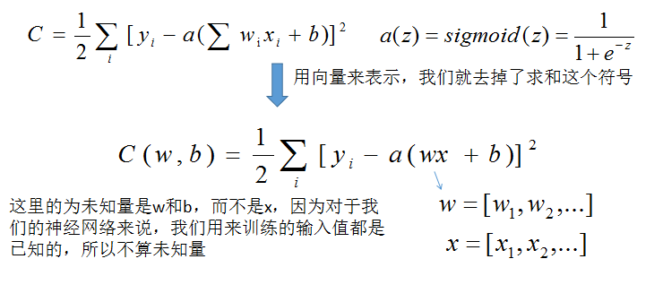

### 成本函数

毛主席有一句名言——从战争中学习战争。当然，他老人家的名言很多，不过这一句话用在这里显然是很好的解释。通俗地讲，那就是失败是成功之母。想一想我们前面提到的神经元，我们要想改变某一个神经元的输出，那么我们就必须要手动设置这个神经元的各个输入的权值、这个神经元的阈值，当我们面对比较少的神经元的时候我们能简单应付，想一想小马的情况，我们很快就找到了多种改变小马决策的方法，但是我们再想一想整个一个神经网络，如果我们的神经网络的神经元非常多，我们怎么可能手动计算每一个神经元的阈值和权值，所以我们要找到一个方法来解决这个问题，让神经网络自己改变自己的神经元的权值以及阈值。

如果你有做过物理实验，你就会发现每一个实验都会要求你写上实验误差，这是一个让人深恶痛绝的行为，因为当我在做实验的时候每一个步骤都有可能造成误差，最好交报告的还得屁颠屁颠地分析这些可能的误差因素会对实验造成多大的影响。好了，伤心事不再提，但是我想说的重点就是这个误差，误差是你的实验结果无期望结果之间的差距。对于我们的神经网络来说，我们希望它能预测某一个东西，但是它却预测错误，那么它就有了误差，如果我们能解决这个误差或是将这个误差极小化，那么我们的神经网络的表现就会变得更好，也就是说它可能会预测出更好的结果。

对于一个神经元，我们平常怎么定义它的误差的呢？如下图：


现在我们推广一下，推广到很多的神经元的情况，这么多的神经元组成一层的神经元，就好像上一章我们最后提到过的神经网络的输出层与隐藏层一样，那么它们的总的误差应该为：


好了，我们知道了所有的某一层的误差怎么表示了，不过我们在想一想，我们神经网络的误差一定是有正有负的，这可不太好，我这个人最不喜欢负数，而且我们要使用误差来说明的问题是我们的神经网络的预测结果的偏差有多大，说明我们想要的是它们的模长，而不是包含正负号的数字大小，这一点希望你能想明白。所以我们怎么做能达到我们的目标呢——将偏差转换成正数，并且这个正数与原本的数的大小有关。你可能说我们可以判断一下这个数是不是负数，是的话取相反数，这样不就成了。其实这样也不错，但是我用一下另一个方法——平方。任何实数的平方都会是非负实数，这下我们的问题得到解决了。

现在我们再来梳理一下神经层的偏差，我们定义一个函数，叫成本函数（cost function），用来表示当前神经层的误差大小，我们不在使用上面使用的`δ`了，而是使用`C`来表示，如下，我们定义成本函数：


我们在前面添加了`1/2`，这个效果下一章节中你会发现它的用处，不过我在这里解释一下，我们的成本函数的函数曲线不会因为它在前面添加了一个参数会发生多大的变化，想一想这两个函数，它们的函数曲线是非常类似的，也就是说在同一个点的变化趋势相类似。
```bash
y = sin( x )

y = 2 * sin( x )
```

这两个函数的变化趋势是类似的，他们会在同一个`x`点达到最小值或者最大值，所以我们的成本函数在其前面添加上一个正的参数是没有影响的，请大家放心。


### BP神经网络如何学习

我们在前面一直没有讲到BP神经网络如何学习，仅仅是介绍了成本函数，不过话说回来，成本函数是衡量一个神经网络预测准确性的标杆啊，如果我们有办法能让这个成本函数每次减小那么一点，我们进行多次的迭代，那么我们最终是一定能将成本函数最小化的，这个时候我们的神经网络一定是学习状态最好的时候。现在我们再次将我们的成本函数改变一下形式，让它看起来更简洁一些。



现在我们看到了我们的成本函数是关于权值`w`以及阈值`b`的函数，如果我们每次都改动这些神经元的权值和阈值那么一点点，那么成本函数就会发生改变，直到变到一个极低的值为止，这就是我们的神经网络的学习过程——通过不断改变网络中的神经元的权值与阈值来使得神经网络的预测能力逐步提升。

[Prev](1.md)  [Next](3.md)